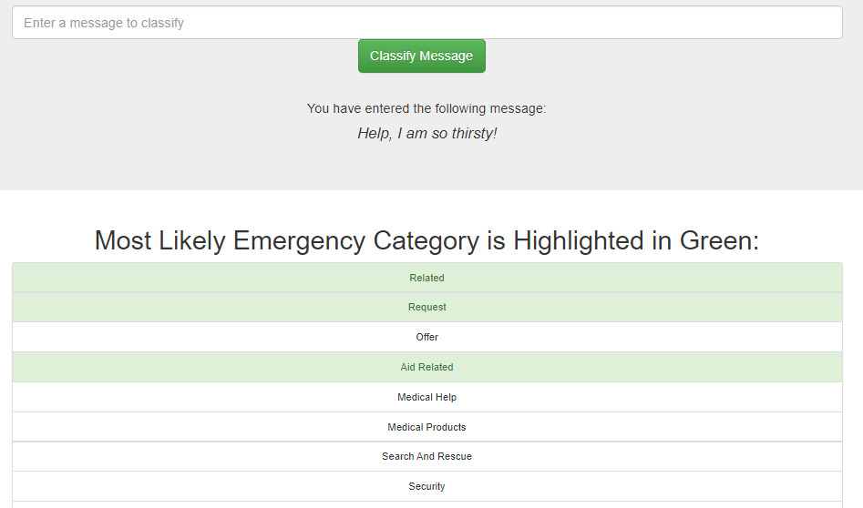

# Disaster Response Project

## Project Overview
This project is part of **Udacity's** Nanodegree in Data Science. While most coding is implemented via Python, some minor web development has been done via JavaScript, HTML and CSS. The project contains a web app which can be hosted anywhere as well as the programming code and dataset used to train the model behind the app. The app consists out of an ETL and ML pipeline, which is connected to a pre-trained classifier. With this app emergency worker can filter incoming messages and classify them in 36 different categories. The aim of this work is to relieve emergency staff in critical stuff, where capacities are at their lowest and fast decision making can save lives.

### The _Multilingual Disaster Response Messages_ Dataset

The data set originally contains a set of over 26K messages related to disaster response in different languages as well as the english translation. The messages are labelled to 36 different emergency categories.  The data was collected by **Figure Eight** during different emergencies and merged into a single dataset.

The data is freely avaible under the following link:  https://appen.com/datasets/combined-disaster-response-data/.
The data is also stored in this respository as:

* **disaster_messages.csv**: contains the over 26 thousand english messages
* **disaster_categories.csv**: contains the corresponding labels of the messages, e.g. the emergency category
* **DisasterResponse.db**: a SQLite database which represents the combined and cleaned version of both csv files, as generated by the supporting code.

### Python Libraries required for hosting the app
* Data Wrangling and Processing: **pandas, sqlalchemy, json, joblib**
* Natural Language Processing: **re, nltk**
* Model Building: **Scikit-Learn**
* Data Visualisation: **Plotly**
* Web Deployment: **Flask**

### Further information on the web development
* Front-end: The web pages were generated with Bootstrap
* Back-end: Flask was employed to generate the back-end code

### Structure of the Code

- "app" folder
| - "template" folder
| |- master.html  # main page of web app
| |- go.html  # classification result page of web app
|- run.py  # Flask file that runs the app - tokenizes incomming text message, loads the trained and displays classification prediction

- "data" folder
|- disaster_categories.csv  # raw data set 
|- disaster_messages.csv  # raw data set 
|- process_data.py        # python script employed to process/clean the datasets
|- DisasterResponse.db   # SQLite database where the cleaned data(frame) was saved in
- "models" folder
|- train_classifier.py #python script which was employed to train the employed model - might contain additional code for curious programmers
|- classifier.pkl  # saved model 

- README.md # The readme containing this very line ;)

### Instructions for locally hosting the app:
1. Run the following commands in the project's root directory to set up your database and model.

    - To run ETL pipeline that cleans data and stores in database
        `python data/process_data.py data/disaster_messages.csv data/disaster_categories.csv data/DisasterResponse.db`
    - To run ML pipeline that trains classifier and saves
        `python models/train_classifier.py data/DisasterResponse.db models/classifier.pkl`

2. Run the following command in the app's directory to run your web app.
    `python run.py`

3. Go to http://0.0.0.0:3001/

### Eample Screenshots of the App

**_Screenshot of the main page_**

**_Screenshot of the plots visualizing information on the dataset_**

**_Message Classification Example 1_**

**_Message Classification Example 2_**

### Information on the classification model

The classication iw based on Scikit-Learns implementation of the random forest algorithm, which was extended with the MultioutputClassifier for multi label classification.
The model was implemented in a ML pipeline and carefully optimized with Scikit-Learns Gridsearch algorithm. While random forest is known for efficiency while not being prone to overfitting, its drawback is that with rising number of trees the file size of the model rises correspondendly. This was somewhat countered by employing the __joblib__ library, which uses more efficient ways to serialize the model and  reduces the file size to a fifth.

### Project Conclussion

The app works fairly well in classifying the messages. However, as the main page plots show, the number of classication examples highly varies for different categories. Thus, the quality of the app is mainly limited by the dataset. Thus represents a typical problem in machine learning - the aviability of data. Future improvements on this work should focuse on aquiring a better balanced dataset.

### Aknowledgement
* **Figure Eight** for collecting and  originally hosting the Data: https://appen.com/datasets/combined-disaster-response-data/.
* **Udacity** for providing this interesting project challenge.
* Sebastian Raschka & Vahid Mirjalili for creating the wonderful book: **Python Machine Learning, ISBN 978-1-78712-593-3**
* A multitude of Stackoverflow users whose questions and answers I found, when looking for a specific coding problem.
